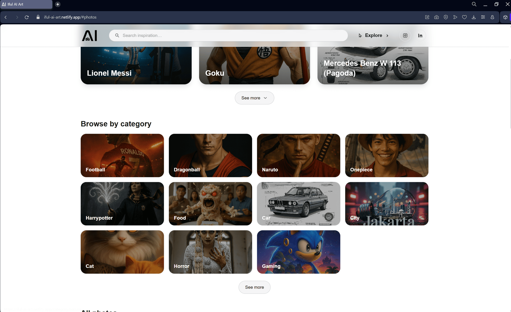
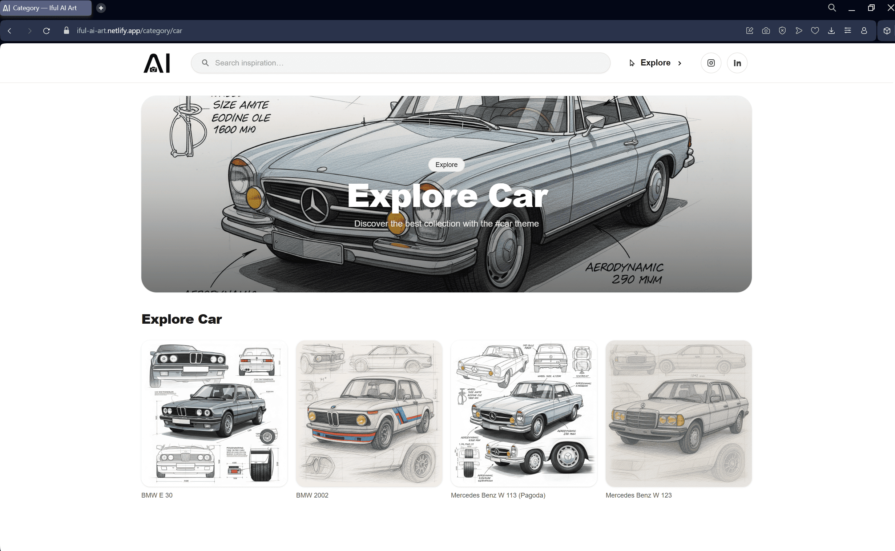
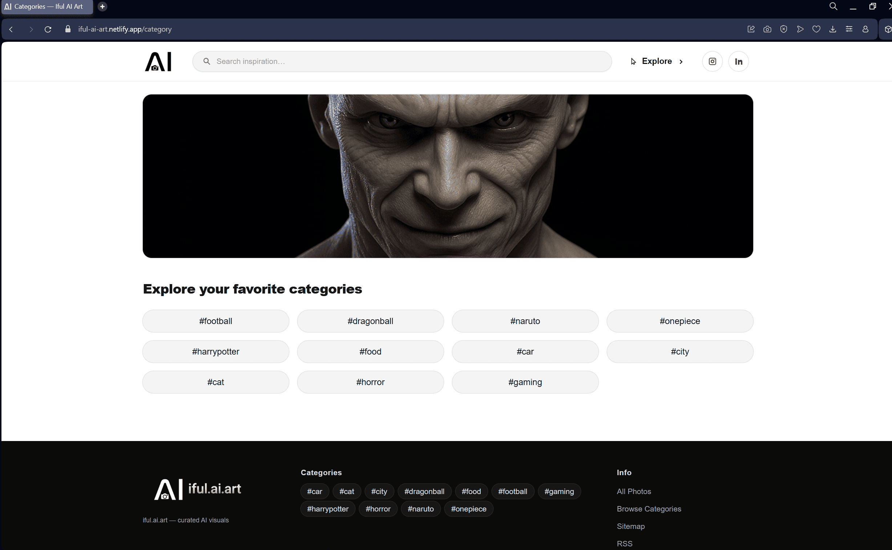

# Iful AI Art

---

## 📖 Overview
**Live Preview:** [https://iful-ai-art.netlify.app](https://iful-ai-art.netlify.app)  

**Iful AI Art** is a modern AI-powered gallery website that showcases AI-generated artwork across multiple categories—from football legends to anime characters, cars, and more.  
It provides a sleek browsing experience with smooth navigation, instant search, category-based filtering, and a visually engaging layout.  

---

## 📸 Screenshots
  
  
  
  

---

## ✨ Features
| Feature                  | Description                                                                 |
|---------------------------|-----------------------------------------------------------------------------|
| **Explore Gallery**       | Discover featured AI-generated artworks in a modern UI.                    |
| **Search Content**        | Quickly find artworks by typing keywords in the search bar.                |
| **Category Browsing**     | Browse artworks by category (Football, Dragonball, Naruto, Cars, etc.).    |
| **Responsive Design**     | Fully responsive and optimized for desktop, tablet, and mobile.            |
| **Smooth Navigation**     | Fast and seamless routing with Next.js.                                    |
| **Minimalist UI**         | Clean, distraction-free interface built with Tailwind CSS & Lucide icons. |

---

## 🛠 Tech Stack
### Frontend
- **Next.js** – React framework for production-ready apps with SSR and SSG.  
- **Tailwind CSS** – Utility-first CSS framework for rapid UI development.  
- **Lucide React** – https://lucide.dev/ - Lightweight icon library for modern web apps.  

---

This is a [Next.js](https://nextjs.org) project bootstrapped with [`create-next-app`](https://nextjs.org/docs/app/api-reference/cli/create-next-app).

## Getting Started

First, run the development server:

```bash
npm run dev
# or
yarn dev
# or
pnpm dev
# or
bun dev
```

Open [http://localhost:3000](http://localhost:3000) with your browser to see the result.

You can start editing the page by modifying `app/page.js`. The page auto-updates as you edit the file.

This project uses [`next/font`](https://nextjs.org/docs/app/building-your-application/optimizing/fonts) to automatically optimize and load [Geist](https://vercel.com/font), a new font family for Vercel.

## Learn More

To learn more about Next.js, take a look at the following resources:

- [Next.js Documentation](https://nextjs.org/docs) - learn about Next.js features and API.
- [Learn Next.js](https://nextjs.org/learn) - an interactive Next.js tutorial.

You can check out [the Next.js GitHub repository](https://github.com/vercel/next.js) - your feedback and contributions are welcome!

## Deploy on Vercel

The easiest way to deploy your Next.js app is to use the [Vercel Platform](https://vercel.com/new?utm_medium=default-template&filter=next.js&utm_source=create-next-app&utm_campaign=create-next-app-readme) from the creators of Next.js.

Check out our [Next.js deployment documentation](https://nextjs.org/docs/app/building-your-application/deploying) for more details.
